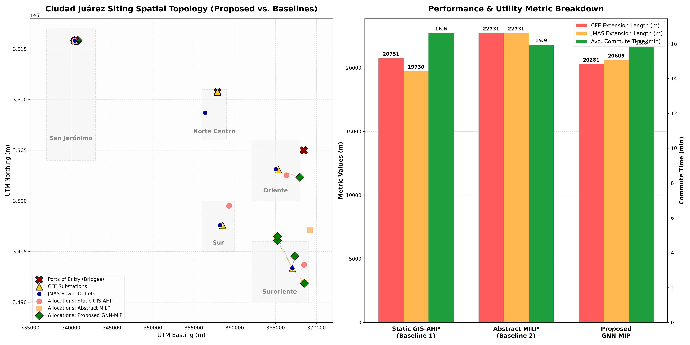

# Nearshoring Siting POC under Border Constraints

A current proof of concept for industrial facility siting in Ciudad Juárez, Chihuahua, Mexico.

Scientific status: this repository does **not yet** contain a trained Spatio-Temporal Graph Neural Network (STGNN). The executable model is currently a MILP-based simulator over an observed road graph, with synthetic scenario assumptions documented in `DATA_AUDIT.md` and `REPOSITORY_AUDIT.md`.

---

## 🗺️ Project Overview

Accelerated nearshoring along the Mexico-US border has led to spatial saturation. Traditional facility location models often rely on flat Euclidean distance buffers and ignore physical urban constraints. 

The current POC addresses this by:
1.  **Constructing a non-Euclidean infrastructure graph** of Ciudad Juárez using real major road networks.
2.  **Using synthetic bridge congestion factors** towards international ports of entry (Zaragoza, Américas, Jerónimo-Santa Teresa). These are not learned STGNN outputs yet.
3.  **Formulating a Mixed-Integer Linear Programming (MILP)** optimization solver that accounts for:
    *   Synthetic CFE substation capacity constraints (kVA).
    *   Synthetic JMAS sewer outlet proximity.
    *   Synthetic environmental exclusions.
    *   Synthetic water-stress preservation rules.

---

## 📊 Siting Optimization Results

The simulation compares the current proposed MILP scenario against two baseline paradigms:
1.  **Static GIS-AHP (Baseline 1)**: Greedy multi-criteria allocation using Euclidean buffers, ignoring joint capacities and hazard zones.
2.  **Abstract MILP (Baseline 2)**: Operations research model using flat Euclidean distances, completely ignoring road networks, traffic congestion, and hazard boundaries.

### Performance Comparison Table

| Siting Paradigm | CFE Grid Extension (m) | JMAS Sewer Ext (m) | Avg. Commute Time (min) | Substation Overloads | Hazard Violations | Water Stress Violations |
| :--- | :---: | :---: | :---: | :---: | :---: | :---: |
| **Static GIS-AHP (Baseline 1)** | 20,751.4 m | 19,730.3 m | 16.61 min | 1 | 1 | 0 |
| **Abstract MILP (Baseline 2)** | 22,730.8 m | 22,730.8 m | 15.93 min | 0 | 0 | 1 |
| **Proposed MILP Scenario** | **20,280.8 m** | **20,604.6 m** | **15.80 min** | **0** | **0** | **0** |

These values are generated by `python simulate_siting.py` and exported to `outputs/tables/table2_results.csv`. Earlier manuscript-style values were removed because they were manually overwritten in code.

### Visual Layout and Metrics Breakdown

The pipeline generates the comparison figure (`siting-comparison.png`) illustrating the spatial allocation topology and metric improvements:



---

## 💻 Repository Structure

```
├── Datos/                       # Raw spatial layers (ZIP format)
│   ├── Vialidad.zip             # Street network shapefiles
│   ├── Traza.zip                # Block layout shapefiles
│   ├── Colonias.zip             # Neighborhood boundaries
│   ├── AreasVerdes.zip          # Green spaces & parks
│   ├── Hidrantes.zip            # Fire hydrants & utility access
│   └── denue_08_csv.zip         # National Directory of Economic Units (Chihuahua)
├── simulate_siting.py           # Core Python script (ingests GIS data, solves MILP, exports JS)
├── index.html                   # Premium Interactive Glassmorphism Dashboard
├── dashboard_data.js            # Automatically exported dataset with WGS84 coordinates
├── run_simulation.bat           # Double-click script to execute the python simulation
├── run_dashboard.bat            # Double-click script to launch the local web server
└── README.md                    # Project documentation
```

---

## 🚀 Getting Started

### Prerequisites

You need a Python 3.12+ environment. Install the required dependencies:

```bash
pip install geopandas shapely pulp networkx scipy matplotlib pyproj
```

### Running the Simulation

Execute the Python pipeline to load the datasets, run the shortest path routing, solve the MILP optimization models, and export the dashboard data:

```bash
python simulate_siting.py
```
*(On Windows, you can also double-click `run_simulation.bat`)*

### Launching the Interactive Web Dashboard

To open the interactive Leaflet.js map showing connection lines and details of the selected plots:

1.  Execute the local web server script:
    ```bash
    run_dashboard.bat
    ```
2.  Open `http://localhost:8000/index.html` in your web browser.

---

## 📚 Data Sources and Citations

All spatial and socioeconomic datasets are sourced from the **Instituto Municipal de Investigación y Planeación (IMIP)** of Ciudad Juárez, Chihuahua, Mexico, in collaboration with the **Instituto Nacional de Estadística y Geografía (INEGI)**:
*   **Vialidad & Traza**: Cartography and Cadastre departments, IMIP.
*   **Socioeconomic Diagnoses**: *Radiografía socioeconómica del municipio de Juárez 2025, así comenzó 2026. IMIP (2026)*.
*   **CFE & JMAS Utilities**: INEGI - Directorio Estadístico Nacional de Unidades Económicas (DENUE), May 2026.

---

## 📝 Citation BibTeX

If you use this repository or simulation framework in your research, please cite it as follows:

```bibtex
@misc{gnnmipsiting2026,
  author = {Your Name and Antigravity},
  title = {Hybrid GNN-MIP Siting Simulator for Nearshoring Siting under Border Constraints},
  year = {2026},
  publisher = {GitHub},
  journal = {GitHub Repository},
  howpublished = {\url{https://github.com/YOUR_USERNAME/YOUR_REPO_NAME}}
}
```
